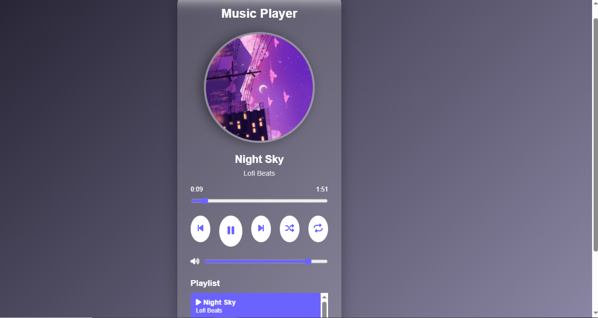

 🎵 JavaScript Music Player

A modern and responsive music player built using **HTML, CSS, and JavaScript**. It provides a smooth music listening experience with playback controls, playlist management, progress tracking, volume control, shuffle, repeat mode, and local storage support.

 📸 Preview



 ✨ Features

- ▶️ Play and Pause music
- ⏭️ Next and Previous song navigation
- 🎵 Dynamic playlist
- 📀 Rotating album cover while music plays
- ⏱️ Current time and total duration display
- 📊 Interactive progress bar with seek functionality
- 🔊 Volume control
- 🔀 Shuffle mode
- 🔁 Repeat current song
- 💾 Saves last played song using Local Storage
- 💾 Remembers volume level after page refresh
- 📱 Responsive design for desktop and mobile devices

🛠️ Built With

- HTML5
- CSS3
- JavaScript (ES6)

 📁 Project Structure

```
Music-Player/
│
├── assets/
│   ├── images/
│   │   ├── cover1.png
│   │   ├── cover2.png
│   │   └── cover3.png
│   │
│   └── songs/
│       ├── song1.mp3
│       ├── song2.mp3
│       └── song3.mp3
│
├── index.html
├── style.css
├── script.js
├── screenshot.png
└── README.md
```

 🚀 Getting Started

### Clone the repository

```bash
git clone https://github.com/Sobia-iqbal56/CodeAlha_Music-Player.git
```

### Open the project

Simply open **index.html** in your browser.

No additional setup is required.

 🎮 How to Use

- Click **Play** to start music.
- Use **Previous** and **Next** buttons to switch songs.
- Click any song in the playlist to play it.
- Drag the progress bar to seek.
- Adjust the volume using the volume slider.
- Enable **Shuffle** for random playback.
- Enable **Repeat** to replay the current song.

 📱 Responsive Design

The application is optimized for:

- Desktop
- Laptop
- Tablet
- Mobile Devices

 🔮 Future Improvements

- 🎶 Dark/Light theme switch
- ❤️ Favorite songs
- 📂 Upload custom music
- 🔍 Search songs
- 🎤 Lyrics support
- 🎨 Multiple music themes
- 🌐 Online music API integration

 👩‍💻 Developer

**Sobia Iqbal**

Computer Software Engineering Student

---

## ⭐ If you like this project

Give it a ⭐ on GitHub!
